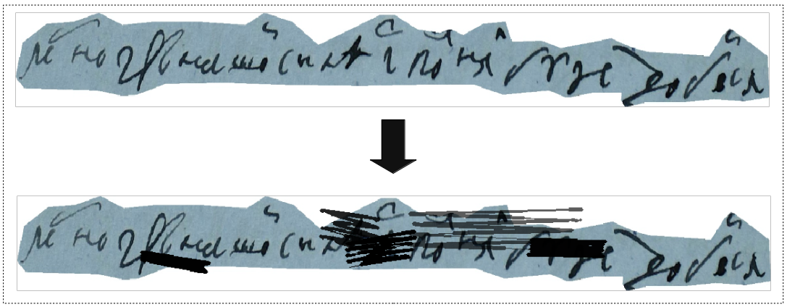

[](https://app.travis-ci.com/TheDenk/hwb)
[](https://codecov.io/gh/TheDenk/hwb)
[](https://lbesson.mit-license.org/)
[](https://shields.io/)
[](https://pepy.tech/project/hwb)

# Hand Written Blots Augmentation
This repository contains augmentation from our <a href="https://arxiv.org/pdf/2108.11667v1.pdf">paper</a>.  

<a href="https://github.com/TheDenk/hwb/blob/main/examples/blots_example.ipynb">Colab Example</a>  


## Handwritten Blots
#### Dependencies  
- bezier>=2020.5.19 

<p>
 
</p> 

## Getting Started
    pip install hwb  

### Example with default parameters  

  Import:  
```python
from hwb import HandWrittenBlot
```
  Using:  
```python
blots = HandWrittenBlot()

new_img = blots(img) 
```
  Done.
 
## Advansed usage 

## Configs description   
### Rectangle parameters  

<p>Config of rectangle that should contains blot.</p>  

```python
rectangle_info = {
    'x': (None, None), ## Minimum and maximum X coordinate for blot position. Can be single int value.

    'y': (None, None), ## Minimum and maximum Y coordinate for blot position. Can be single int value.

    'h': (None, None), ## Minimum and maximum blots Height. Can be single int value.  

    'w': (None, None), ## Minimum and maximum blots Width. Can be single int value. 
}
```
  
### Blots parameters
<p>Config of different blots parameters.</p>  
  
```python 
blot_params = {
    'incline': (-10, 10), # Incline of blots. All left or right points of blot will be shifted on this value. Can be single int value.

    'intensivity': (0.5, 0.9), # Points count that will be generated for blots. Can be single float value (0, 1).

    'transparency': (0.05, 0.4), # Blots transparency. Can be single float value (0, 1).

    'count': (1, 5), # Min Max Blots count.
}
```  
### Example with configs  

```python
from hwb import HandWrittenBlot

blots = HandWrittenBlot(rectangle_info, blot_params)

new_img = blots(img)
```

## Contacts
<p>Issues should be raised directly in the repository. For professional support and recommendations please <a>welcomedenk@gmail.com</a>.</p>
  
  
